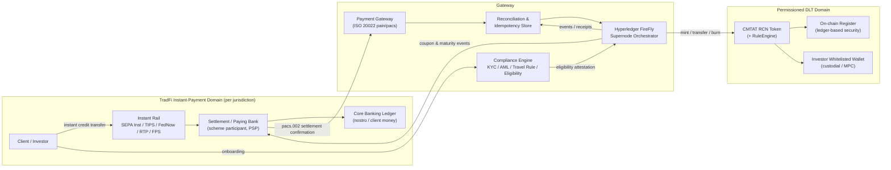
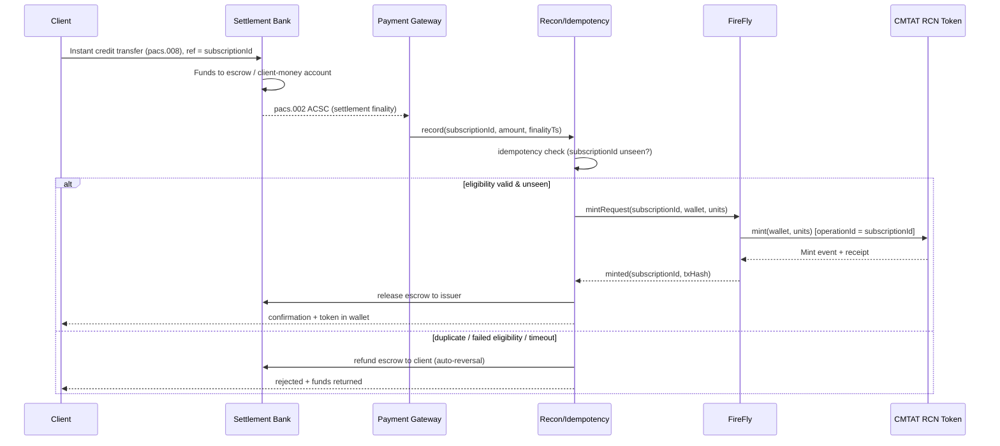
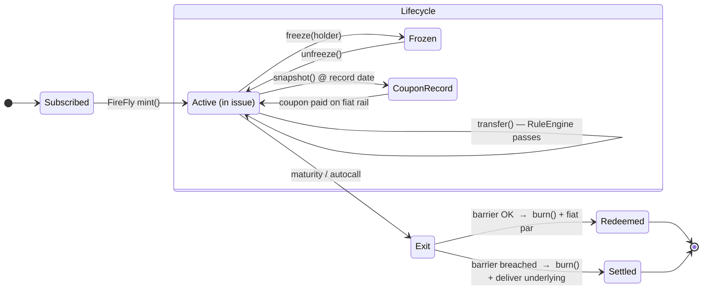

# Instant-Payment Front-to-Back Settlement Gateway for Tokenized Reverse Convertible Notes (RCN)

### A cross-border, multi-jurisdiction reference architecture bridging TradFi instant-payment rails to a permissioned DLT, orchestrated by Hyperledger FireFly, minting / transferring / burning CMTAT tokens

> **Authored by a cross-functional panel perspective:** DLT / Solidity engineering · Hyperledger FireFly integration architecture · cross-border payments & settlement · multi-jurisdiction banking, securities & AML compliance.
>
> **⚠️ Not legal, tax, accounting or investment advice.** This is an engineering reference. Every control described must be validated with licensed counsel and your regulators in each jurisdiction before production use. Regulatory citations are directional and current as of authoring; verify against the live rulebooks.

---

## 0. TL;DR

We describe a gateway that lets a regulated institution take **instant fiat payment** from a client on domestic real-time rails (SEPA Instant, TIPS, FedNow, RTP, UK Faster Payments), and, on confirmed settlement finality of the cash leg, **mint a CMTAT token** that represents a **Reverse Convertible Note (RCN)** — a yield-enhancement structured product = *zero-coupon bond + short put on an underlying*. Over the note's life the token supports **coupon distribution, secondary transfer under eligibility rules, and at maturity either cash redemption (burn) or physical delivery** when the barrier is breached. All on-chain actions are driven by **Hyperledger FireFly** as the orchestration layer (token connector + blockchain connector + event streams + off-chain data exchange), never by hand.

The hard part is not the token. It is **atomicity between a TradFi cash leg and a DLT security leg across jurisdictions with different finality, different regulators, and different definitions of what the token legally *is***.

---

## 1. Scope, actors, and the product

### 1.1 The instrument — Reverse Convertible Note (RCN)

An RCN is a **structured note**. Economically:

```
RCN = zero-coupon note (issuer credit)  +  investor SHORT a put on an underlying
```

- Investor pays par (e.g., 100), receives an **above-market fixed coupon** (funded by the option premium the investor implicitly sells).
- At maturity, observation vs a **strike / barrier** (e.g., 70% of initial):
  - Underlying ≥ barrier → **cash redemption at par** + final coupon. Token is **burned**.
  - Underlying < barrier → **physical settlement**: investor receives the underlying (or its cash equivalent) at a loss + final coupon. Token is **burned**, delivery obligation triggered.
- Variants the token model must accommodate: **barrier / knock-in (BRCN)**, **worst-of basket**, **autocallable** (early redemption on observation-date triggers).

Key implication: the RCN is a **debt security / structured product**, not e-money and not a payment token. That classification drives the entire compliance overlay (prospectus/PRIIPs KID, MiFID II product governance & appropriateness, transfer-agent duties).

### 1.2 Actors

| Actor | Role |
|---|---|
| **Client / Investor** | Pays fiat on instant rail; holds RCN token in a whitelisted wallet (custodial or MPC). |
| **Issuer / Arranger** | Regulated entity that issues the RCN and is the on-chain `minter`/`burner` authority. |
| **Paying / Settlement Bank** | Holds client fiat, operates the instant-payment endpoint (PSP / scheme participant). |
| **Transfer Agent / Registrar** | Maintains the legally authoritative register. Under CMTA / Swiss DLT law the **token itself can be the register** (ledger-based security). |
| **Custodian** | Safekeeps tokens and/or the underlying deliverable at maturity. |
| **FireFly Orchestrator** | The gateway's brain: correlates payment events ↔ token lifecycle, enforces idempotency, drives mint/transfer/burn. |
| **Compliance / KYC-AML engine** | Sanctions, Travel Rule, eligibility, jurisdiction gating. |
| **Regulators** | FINMA, ESMA/NCAs, FCA, MAS, SEC/FINRA, etc. per jurisdiction. |

---

## 2. Why CMTAT + FireFly

### 2.1 CMTAT (Capital Markets and Technology Association Token)

[CMTAT](https://github.com/CMTA/CMTAT) is a Swiss-originated, open-source, audited **ERC-20-based security-token framework** explicitly designed to represent **ledger-based securities** under Swiss law (CO Art. 973d ff., the "DLT Act"). It ships modular functionality that maps almost 1:1 onto structured-note lifecycle needs:

| CMTAT module | RCN lifecycle use |
|---|---|
| **Mint / Burn** | Issue note on cash finality; redeem/settle at maturity or autocall. |
| **Pause (`PauseModule`)** | Freeze the whole issuance (market disruption, legal hold, incident). |
| **Enforcement / Freeze (`EnforcementModule`)** | Freeze a single holder (sanctions hit, court order, failed re-KYC). |
| **Validation / Allowlist (`ValidationModule` + RuleEngine)** | Gate every transfer through eligibility / jurisdiction rules on-chain. |
| **Snapshot (`SnapshotModule`)** | Fix holder-of-record set for each **coupon record date**. |
| **Document / Terms (`BaseModule` `tokenId`/`terms`)** | Anchor the ISIN, term sheet, PRIIPs KID hash on-chain. |
| **Debt / Credit events (`DebtModule`, `CreditEventsModule`)** | Encode coupon schedule, maturity, and default / barrier-breach flags. |
| **Forced transfer** | Court-ordered or corporate-action reallocation. |

CMTAT's **RuleEngine** pattern (ERC-1404-style transfer restriction) is where investor eligibility, lock-ups, and jurisdiction gating live — the compliance layer is *composable* and upgradeable without reissuing the token.

### 2.2 Hyperledger FireFly (Enterprise)

[FireFly](https://hyperledger.github.io/firefly/) is an **orchestration supernode** that abstracts the raw chain behind higher-level APIs and event streams. For this gateway it provides exactly the plumbing an instant-payment bridge needs:

- **Token connector** — normalized mint/transfer/burn API over the CMTAT contract (ERC-20 pool), so the orchestrator issues *business* calls, not raw `eth_sendRawTransaction`.
- **Blockchain connector** (EVMConnect / ethconnect) — nonce management, gas, reliable submission, receipt tracking.
- **Event streams / subscriptions** — durable, at-least-once delivery of on-chain events (`Transfer`, `Mint`, `Burn`, RuleEngine rejects) back to the orchestrator with checkpointing.
- **Data exchange & shared storage (off-chain)** — move the KID / term sheet / KYC attestations privately between counterparties; put only hashes on-chain (PII stays off-ledger — GDPR-critical).
- **Transaction manager** — idempotent, retried, operation-tracked submission. This is what makes the "exactly-once mint per payment" guarantee tractable.
- **Multiparty / private data** — for a consortium DLT where issuer, paying bank, and transfer agent each run a FireFly node.

Net: FireFly is the deterministic state machine that turns *"cash settled with finality"* into *"token minted, once, to the right wallet, with the right restrictions, and every party notified."*

---

## 3. Front-to-back architecture



### 3.1 The five phases, front to back

1. **Onboard & classify** — KYC/KYB, MiFID II appropriateness/suitability, jurisdiction & investor-category gating; wallet whitelisted into RuleEngine.
2. **Subscribe & pay** — client sends instant payment; gateway captures ISO 20022 `pacs.008`/`pacs.002`, waits for **scheme settlement finality**.
3. **Mint on finality** — FireFly mints the CMTAT RCN token to the whitelisted wallet, **exactly once**, anchoring ISIN + KID hash.
4. **Lifecycle** — snapshot at each coupon record date → coupon paid on fiat rail; secondary transfers only between eligible wallets; corporate actions / autocall triggers via oracle.
5. **Maturity / settle** — barrier observation drives cash redemption (burn + fiat par) **or** physical delivery (burn + underlying delivery); register updated; reporting emitted.

---

## 4. The atomicity problem (the actual hard part)

A domestic instant rail and a DLT have **independent, non-atomic finality**. You cannot two-phase-commit a FedNow leg and an EVM block. Four ways to bridge, worst→best for this use case:

| Model | Mechanism | Trade-off |
|---|---|---|
| **Naïve sequential** | Confirm cash → then mint | Simple; but window of "cash taken, token not yet minted." Must be reconciled + reversible. |
| **Escrow / conditional** | Cash held in client-money/escrow; mint on release; auto-refund on timeout | Strong client protection; needs safeguarded account + legal escrow construct. |
| **PvP / DvP via HTLC or notary** | Hash-time-locked or notary-signed atomic swap of cash-leg proof ↔ token | True delivery-vs-payment; needs a tokenized cash leg or a trusted notary oracle. |
| **Tokenized cash leg** | Stablecoin / tokenized deposit / wCBDC on same ledger → **on-chain DvP is atomic** | Cleanest atomicity; but introduces its own money classification (EMT under MiCA, deposit-token law). |

**Recommended:** *escrow-backed sequential with idempotent reconciliation* for pure-fiat rails today, migrating to *on-chain DvP against a tokenized deposit* where the jurisdiction permits it. The **cash-leg problem** — no atomic settlement asset on the securities ledger — is the single biggest architectural constraint; design the reconciliation store as the source of truth, not the chain.

### 4.1 Payment → mint sequence (escrow-backed, idempotent)



Idempotency key = `subscriptionId`, carried from the ISO 20022 end-to-end id through FireFly's `operationId`. Re-delivery of a payment event **never** double-mints.

---

## 5. CMTAT ↔ RCN lifecycle mapping



Three ways out of **Active**: recurring coupon cycle (snapshot→pay→back to Active), an involuntary **Frozen** hold (sanctions/court), and the terminal **Exit** — a single decision node where the barrier observation routes to cash redemption *or* physical delivery. Autocall enters the same Exit node early.

Notes:
- **Snapshot** freezes the holder-of-record set so coupon (paid off-chain on the fiat rail) matches on-chain holders at the record instant — even if the token trades right after.
- **Barrier observation** comes from a **price oracle** the orchestrator trusts (issuer valuation agent / signed feed), not an unauthenticated public oracle — this is a regulated valuation input.
- **Physical settlement** burns the token and triggers an off-chain delivery obligation (custodian delivers the underlying); the token never *becomes* the underlying.

---

## 6. Multi-jurisdiction compliance matrix

The token's legal nature (**structured debt security**) is broadly stable, but *rails, register law, disclosure, and marketing rules diverge*. This is where "cross-border, cross-jurisdiction" bites.

| Dimension | 🇨🇭 Switzerland | 🇪🇺 EU | 🇬🇧 UK | 🇸🇬 Singapore | 🇺🇸 US |
|---|---|---|---|---|---|
| **Instant rail** | SIC / (SEPA via EUR) | SEPA Inst, TIPS | Faster Payments | FAST / PayNow | FedNow, RTP |
| **Token-as-register basis** | DLT Act — ledger-based securities (CO 973d ff.); FINMA | MiCA (payment/utility) **+ MiFID II** for the security; DLT Pilot Regime for MTF/SS | FSMA; FCA; Digital Securities Sandbox | SFA; MAS PS Act for payments | Securities Act / Exchange Act; likely a **security** |
| **Product disclosure** | FIDLEV KID | **PRIIPs KID** + Prospectus Reg | UK PRIIPs / consumer duty | MAS product highlights sheet | Reg S / 144A private placement; prospectus if public |
| **Investor gating** | Qualified/retail (FIDLEV) | MiFID II categories + product governance | FCA client categorisation | Accredited/institutional | Accredited investor / QIB |
| **AML / Travel Rule** | AMLA; VASP travel rule | AMLD / **TFR (Travel Rule)** | MLR 2017 | PS Act / MAS Notice | BSA / FinCEN Travel Rule |
| **Cross-border marketing** | reverse solicitation limits | passporting vs NPPR | overseas persons exclusion | offers of securities regime | Reg S offshore / no US persons |

Engineering consequences (all enforced in the **RuleEngine + Compliance Engine**, not in the UI):
- **Jurisdiction of the wallet holder** is an attribute checked on *every* transfer, not just at mint — a token minted to an eligible EU investor must not transfer to a US person if the offering was Reg S.
- **Travel Rule** (originator/beneficiary data) applies to token transfers above thresholds where the token qualifies as a VASP-transferable asset — orchestrator attaches IVMS-101 payloads via FireFly data exchange (off-chain), hash on-chain.
- **PII off-chain always.** On-chain stores only hashes/attestation references. GDPR "right to erasure" is incompatible with immutable PII.
- **Marketing/solicitation** gating is pre-onboarding (who can even see the offer), enforced before a wallet is ever whitelisted.

---

## 7. Code skeletons

> Illustrative, **unaudited**, not production. CMTAT is used as the base; the RCN logic is an extension module + off-chain orchestration. Real deployments should extend the audited CMTAT release and keep business logic minimal/on upgradeable modules.

### 7.1 RCN token — extending CMTAT (Solidity, illustrative)

```solidity
// SPDX-License-Identifier: MPL-2.0
pragma solidity ^0.8.20;

// Illustrative extension over the audited CMTAT base.
// import "@cmtat/contracts/CMTAT_STANDALONE.sol";  // real: extend the released CMTAT

/// @title RCNToken — Reverse Convertible Note as a CMTAT ledger-based security
/// @notice Business logic is deliberately thin; lifecycle is DRIVEN by the
///         off-chain FireFly orchestrator, which holds ISSUER_ROLE.
contract RCNToken /* is CMTAT_STANDALONE */ {
    // --- roles (mirror CMTAT AccessControl) ---
    bytes32 public constant ISSUER_ROLE     = keccak256("ISSUER_ROLE");     // FireFly signing identity
    bytes32 public constant SETTLEMENT_ROLE = keccak256("SETTLEMENT_ROLE"); // maturity settlement
    bytes32 public constant ORACLE_ROLE     = keccak256("ORACLE_ROLE");     // valuation agent feed

    struct Terms {
        bytes32 isin;            // note ISIN
        bytes32 kidHash;         // hash of PRIIPs KID / term sheet (doc off-chain)
        bytes32 underlyingRef;   // underlying id (single / worst-of basket ref)
        uint64  issueDate;
        uint64  maturityDate;
        uint256 couponBps;       // annual coupon in bps
        uint256 barrierBps;      // barrier as bps of initial (e.g. 7000 = 70%)
        bool    autocallable;
    }

    Terms  public terms;
    bool   public barrierBreached;   // set by ORACLE_ROLE on observation
    bool   public matured;

    event Minted(bytes32 indexed subscriptionId, address indexed to, uint256 units);
    event CouponRecord(uint256 indexed snapshotId, uint64 recordDate);
    event BarrierObserved(bool breached, uint256 levelBps, uint64 ts);
    event Redeemed(address indexed holder, uint256 units, bool physical);

    // --- issuance: called ONCE per subscription by FireFly (idempotency off-chain) ---
    function mintOnSettlement(bytes32 subscriptionId, address to, uint256 units)
        external /* onlyRole(ISSUER_ROLE) */
    {
        // RuleEngine (CMTAT ValidationModule) MUST pass: `to` is eligible + right jurisdiction
        // _mint(to, units);
        emit Minted(subscriptionId, to, units);
    }

    // --- coupon record date: fix holders-of-record for off-chain fiat payout ---
    function takeCouponSnapshot(uint64 recordDate)
        external /* onlyRole(ISSUER_ROLE) */ returns (uint256 snapshotId)
    {
        // snapshotId = _snapshot(); // CMTAT SnapshotModule
        emit CouponRecord(snapshotId, recordDate);
    }

    // --- barrier observation from the regulated valuation agent ---
    function observeBarrier(uint256 levelBps)
        external /* onlyRole(ORACLE_ROLE) */
    {
        if (levelBps < terms.barrierBps) barrierBreached = true;
        emit BarrierObserved(barrierBreached, levelBps, uint64(block.timestamp));
    }

    // --- maturity / autocall settlement: burn + trigger off-chain cash or delivery ---
    function settle(address holder, uint256 units)
        external /* onlyRole(SETTLEMENT_ROLE) */
    {
        require(block.timestamp >= terms.maturityDate || terms.autocallable, "not settleable");
        bool physical = barrierBreached;          // short put ITM => physical delivery
        // _burn(holder, units);
        matured = true;
        emit Redeemed(holder, units, physical);   // orchestrator pays par OR delivers underlying
    }
}
```

### 7.2 FireFly orchestrator — mint on payment finality (TypeScript, illustrative)

```typescript
import FireFly from "@hyperledger/firefly-sdk";

const firefly = new FireFly({ host: process.env.FIREFLY_URL! });
const POOL = process.env.RCN_TOKEN_POOL!; // CMTAT ERC-20 pool name in FireFly

// Called by the payment gateway on ISO 20022 pacs.002 settlement finality.
// Idempotent on subscriptionId — safe under at-least-once event delivery.
export async function onPaymentFinality(evt: {
  subscriptionId: string;   // == ISO 20022 end-to-end id == FireFly operationId
  wallet: string;
  units: string;
  finalityTs: string;
}) {
  // 1. Idempotency: has this subscription already been minted?
  if (await alreadyMinted(evt.subscriptionId)) return; // dedupe

  // 2. Eligibility re-check at time of mint (jurisdiction / sanctions / category)
  const ok = await compliance.check(evt.wallet, evt.subscriptionId);
  if (!ok) return refundEscrow(evt.subscriptionId); // auto-reversal, cash never trapped

  // 3. Mint via FireFly token connector — operationId ties chain op to the payment.
  //    FireFly's transaction manager handles nonce/gas/retry/receipt tracking.
  await firefly.mintTokens(
    { pool: POOL, to: evt.wallet, amount: evt.units,
      message: { header: { tag: "rcn-mint" },
                 data: [{ value: { subscriptionId: evt.subscriptionId } }] } },
    { requestId: evt.subscriptionId, confirm: true }, // idempotency + wait for finality
  );
}

// Durable subscription to on-chain events -> drives reconciliation, never polls chain.
firefly.listen(
  { name: "rcn-events", ephemeral: false, filter: { events: "token_transfer|token_mint" } },
  async (_socket, event) => {
    await recon.record(event);          // update source-of-truth store
    if (event.type === "token_mint") await releaseEscrowToIssuer(event);
  },
);
```

### 7.3 Coupon distribution (record-date snapshot → fiat payout)

```typescript
// At each coupon record date: snapshot holders on-chain, pay coupon off-chain on the fiat rail.
export async function distributeCoupon(recordDate: string) {
  const snap = await firefly.invokeContractMethod(
    { location: { channel: POOL }, method: "takeCouponSnapshot", input: { recordDate } },
    { confirm: true });
  const holders = await getHoldersAtSnapshot(snap.output.snapshotId); // from FireFly index
  for (const h of holders) {
    const coupon = computeCoupon(h.units); // couponBps applied
    await payments.instantPayout(h.fiatAccount, coupon, `coupon:${recordDate}`); // SEPA Inst / RTP...
  }
}
```

---

## 8. Reliability, reconciliation, and failure modes

| Failure | Handling |
|---|---|
| Payment finality event lost | FireFly durable event stream + gateway re-drive from ISO 20022 status; recon store is source of truth. |
| Duplicate payment event | Idempotency key (`subscriptionId`) → mint is exactly-once. |
| Cash settled, mint reverts (RuleEngine reject) | Auto-refund escrow; alert compliance; no partial state. |
| Mint succeeds, cash refund somehow triggered | Impossible if escrow release is gated on `token_mint` event (release-after-mint ordering). |
| Chain reorg / non-finality | FireFly `confirm:true` waits configured confirmations; treat only finalized receipts as settlement. |
| Oracle / valuation dispute at barrier | Signed valuation-agent feed with ORACLE_ROLE; disputes handled off-chain per term sheet, `Pause` if systemic. |
| Sanctions hit on existing holder | `EnforcementModule.freeze(holder)`; coupon withheld; report. |

**Invariant:** the reconciliation store — not the chain and not the core-banking ledger alone — is the correlated source of truth across the two domains. Both legs reconcile *to it*.

---

## 9. Threat model (abridged)

- **Key compromise (ISSUER_ROLE):** unauthorized mint. → HSM/MPC signer, multi-sig on issuer role, FireFly identity isolation, per-op limits, `Pause`.
- **Oracle manipulation at barrier:** wrongful physical settlement. → signed regulated feed, multi-source, dispute window.
- **Replay of payment events:** double mint. → idempotency key end-to-end.
- **Eligibility bypass on secondary transfer:** ineligible/ sanctioned holder. → on-chain RuleEngine gating *every* transfer, not just mint.
- **PII on-chain:** GDPR breach + permanent exposure. → hashes only; PII via FireFly private data exchange.
- **Cross-jurisdiction leakage:** Reg S token reaching a US person. → jurisdiction attribute enforced on transfer + geofenced onboarding.
- **Cash-leg trapping:** client paid, no token, no refund. → escrow + timeout auto-reversal + recon reconciliation.

---

## 10. Build sequence (pragmatic)

1. Stand up FireFly supernode(s): blockchain connector (EVMConnect) + token connector (ERC-20) + event streams. Confirm mint/transfer/burn round-trips.
2. Deploy CMTAT base on a permissioned EVM chain; wire RuleEngine with a stub eligibility rule.
3. Build the reconciliation/idempotency store + ISO 20022 ingestion (`pacs.002` finality) on **one** domestic rail first (e.g., SEPA Instant sandbox).
4. Implement escrow-backed mint-on-finality with auto-reversal; prove exactly-once + refund paths.
5. Add lifecycle: snapshot→coupon, barrier oracle, maturity settle (cash & physical).
6. Layer compliance: KYC/AML, Travel Rule payloads, jurisdiction gating; move PII off-chain.
7. Extend to a second jurisdiction/rail; generalize the jurisdiction matrix into RuleEngine config.
8. Independent audit (Solidity + orchestration) + legal opinion per jurisdiction before any live issuance.

---

## 11. References

- CMTAT — https://github.com/CMTA/CMTAT · CMTA standards — https://cmta.ch
- Hyperledger FireFly — https://hyperledger.github.io/firefly/
- Swiss DLT Act / ledger-based securities — CO Art. 973d ff.
- EU MiCA (Reg 2023/1114), MiFID II, PRIIPs (Reg 1286/2014), DLT Pilot Regime (Reg 2022/858), Transfer of Funds Reg (TFR)
- ISO 20022 payment messages (pain / pacs); SEPA Instant (EPC), TIPS, FedNow, RTP (TCH), UK Faster Payments
- FATF Travel Rule / IVMS-101 data standard

---

*Reference architecture only. Validate every control with licensed counsel and your regulators before production. No warranty.*
