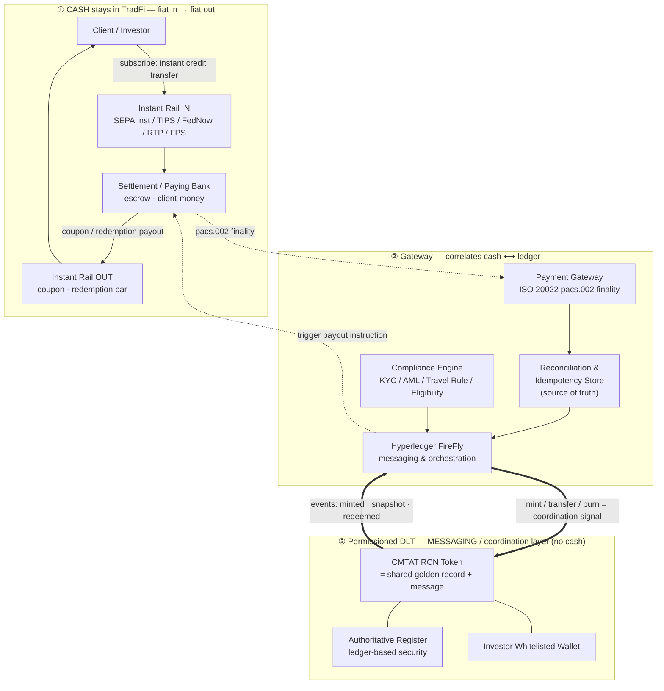
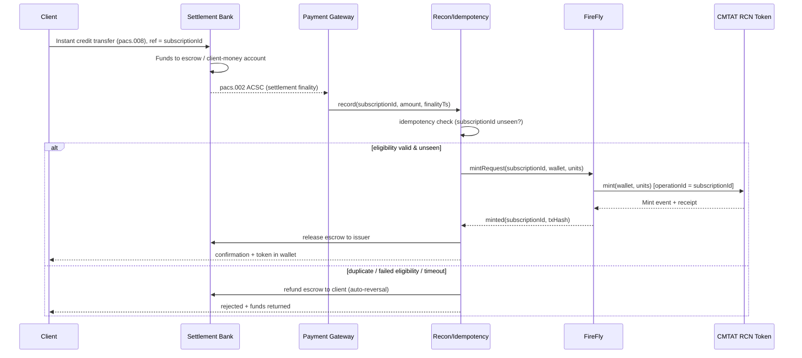
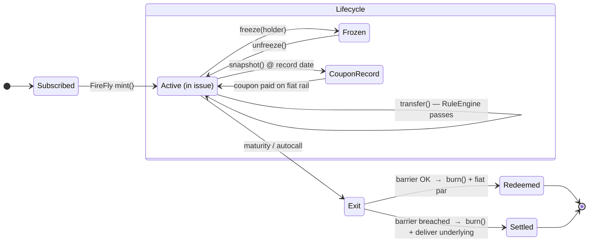

# Instant-Payment Front-to-Back Settlement Gateway for Tokenized Reverse Convertible Notes (RCN)

### A cross-border, multi-jurisdiction reference architecture where cash flows TradFi → TradFi and a permissioned DLT acts as the shared messaging / coordination layer — orchestrated by Hyperledger FireFly, minting / transferring / burning CMTAT tokens

> **Authored by a cross-functional panel perspective:** DLT / Solidity engineering · Hyperledger FireFly integration architecture · cross-border payments & settlement · multi-jurisdiction banking, securities & AML compliance.
>
> **⚠️ Not legal, tax, accounting or investment advice.** This is an engineering reference. Every control described must be validated with licensed counsel and your regulators in each jurisdiction before production use. Regulatory citations are directional and current as of authoring; verify against the live rulebooks.

📊 **Slide deck:** [`RCN-CMTAT-FireFly-Gateway.pptx`](./RCN-CMTAT-FireFly-Gateway.pptx) (16 slides, 16:9) · regenerate with [`build_deck.py`](./build_deck.py) (`pip install python-pptx && python3 build_deck.py`).

**At a glance:** `client pays (TradFi instant rail)` → `escrow + finality` → `FireFly mints CMTAT RCN token = coordination message` → `lifecycle: coupon snapshot · eligible transfer · barrier observe` → `burn` → `client paid back (TradFi instant rail)`. **Cash never touches the chain; the DLT is the shared message bus between institutions.**

### Contents

| # | Section | # | Section |
|---|---|---|---|
| 0 | [TL;DR](#0-tldr) | 7 | [Code skeletons](#7-code-skeletons) |
| 1 | [The instrument (RCN)](#1-scope-actors-and-the-product) | 8 | [Reliability & failure modes](#8-reliability-reconciliation-and-failure-modes) |
| 2 | [Why CMTAT + FireFly](#2-why-cmtat--firefly) | 9 | [Threat model](#9-threat-model-abridged) |
| 3 | [Front-to-back architecture](#3-front-to-back-architecture) | 10 | [Build sequence](#10-build-sequence-pragmatic) |
| 4 | [The coordination problem](#4-the-coordination-problem-the-actual-hard-part) | 11 | [Design fork: register vs message](#11-design-fork-is-the-token-the-register-or-just-the-message) |
| 5 | [CMTAT ↔ RCN lifecycle](#5-cmtat--rcn-lifecycle-mapping) | 12 | [Governance — specialist committee](#12-governance--the-specialist-committee-that-ranks--signs-off) |
| 6 | [Jurisdiction matrix](#6-multi-jurisdiction-compliance-matrix) | 13 | [References](#13-references) |

---

## 0. TL;DR

**The money never leaves TradFi.** Cash flows **TradFi → TradFi**: the client pays on a domestic real-time rail (SEPA Instant, TIPS, FedNow, RTP, UK Faster Payments) into a regulated account, and every payout (coupon, redemption par) goes back out on a real-time rail to the client. The **permissioned DLT is not a value-transfer rail — it is the shared messaging, coordination and golden-record layer** that binds the multiple TradFi participants (issuer, paying/settlement bank, transfer agent, custodian) to a single, tamper-evident view of the note's state.

On that ledger, a **CMTAT token** represents the **Reverse Convertible Note (RCN)** — a yield-enhancement structured product = *zero-coupon bond + short put on an underlying*. The token is the **authoritative register + the message** that says *"this holder owns this note, in this state."* Its lifecycle events — mint on cash finality, coupon record snapshot, transfer under eligibility, burn on redemption/settlement — are the **coordination signals** that trigger the corresponding **TradFi cash movements**. All on-chain actions are driven by **Hyperledger FireFly** as the orchestration/messaging layer (token connector + blockchain connector + event streams + off-chain private data exchange), never by hand.

So the pattern is: **fiat in (TradFi) → DLT coordinates & records → fiat out (TradFi)**. The DLT replaces the reconciliation-by-email/SWIFT-message spaghetti between institutions with one shared state machine. The hard part is therefore **not** moving value on-chain — it is **correlating off-chain cash events to on-chain coordination events, idempotently, across jurisdictions** with different finality, regulators, and legal definitions of the token.

---

## 1. Scope, actors, and the product

### 1.1 The instrument — Reverse Convertible Note (RCN)

An RCN is a **structured note**. Economically:

```
RCN = zero-coupon note (issuer credit)  +  investor SHORT a put on an underlying
```

- Investor pays par (e.g., 100), receives an **above-market fixed coupon** (funded by the option premium the investor implicitly sells).
- At maturity, observation vs a **strike / barrier** (e.g., 70% of initial):
  - Underlying ≥ barrier → **cash redemption at par** + final coupon. Token is **burned**.
  - Underlying < barrier → **physical settlement**: investor receives the underlying (or its cash equivalent) at a loss + final coupon. Token is **burned**, delivery obligation triggered.
- Variants the token model must accommodate: **barrier / knock-in (BRCN)**, **worst-of basket**, **autocallable** (early redemption on observation-date triggers).

Key implication: the RCN is a **debt security / structured product**, not e-money and not a payment token. That classification drives the entire compliance overlay (prospectus/PRIIPs KID, MiFID II product governance & appropriateness, transfer-agent duties).

### 1.2 Actors

| Actor | Role |
|---|---|
| **Client / Investor** | Pays fiat on instant rail; holds RCN token in a whitelisted wallet (custodial or MPC). |
| **Issuer / Arranger** | Regulated entity that issues the RCN and is the on-chain `minter`/`burner` authority. |
| **Paying / Settlement Bank** | Holds client fiat, operates the instant-payment endpoint (PSP / scheme participant). |
| **Transfer Agent / Registrar** | Maintains the legally authoritative register. Under CMTA / Swiss DLT law the **token itself can be the register** (ledger-based security). |
| **Custodian** | Safekeeps tokens and/or the underlying deliverable at maturity. |
| **FireFly Orchestrator** | The gateway's brain: correlates payment events ↔ token lifecycle, enforces idempotency, drives mint/transfer/burn. |
| **Compliance / KYC-AML engine** | Sanctions, Travel Rule, eligibility, jurisdiction gating. |
| **Regulators** | FINMA, ESMA/NCAs, FCA, MAS, SEC/FINRA, etc. per jurisdiction. |

---

## 2. Why CMTAT + FireFly

### 2.1 CMTAT (Capital Markets and Technology Association Token)

[CMTAT](https://github.com/CMTA/CMTAT) is a Swiss-originated, open-source, audited **ERC-20-based security-token framework** explicitly designed to represent **ledger-based securities** under Swiss law (CO Art. 973d ff., the "DLT Act"). It ships modular functionality that maps almost 1:1 onto structured-note lifecycle needs:

| CMTAT module | RCN lifecycle use |
|---|---|
| **Mint / Burn** | Issue note on cash finality; redeem/settle at maturity or autocall. |
| **Pause (`PauseModule`)** | Freeze the whole issuance (market disruption, legal hold, incident). |
| **Enforcement / Freeze (`EnforcementModule`)** | Freeze a single holder (sanctions hit, court order, failed re-KYC). |
| **Validation / Allowlist (`ValidationModule` + RuleEngine)** | Gate every transfer through eligibility / jurisdiction rules on-chain. |
| **Snapshot (`SnapshotModule`)** | Fix holder-of-record set for each **coupon record date**. |
| **Document / Terms (`BaseModule` `tokenId`/`terms`)** | Anchor the ISIN, term sheet, PRIIPs KID hash on-chain. |
| **Debt / Credit events (`DebtModule`, `CreditEventsModule`)** | Encode coupon schedule, maturity, and default / barrier-breach flags. |
| **Forced transfer** | Court-ordered or corporate-action reallocation. |

CMTAT's **RuleEngine** pattern (ERC-1404-style transfer restriction) is where investor eligibility, lock-ups, and jurisdiction gating live — the compliance layer is *composable* and upgradeable without reissuing the token.

### 2.2 Hyperledger FireFly (Enterprise)

[FireFly](https://hyperledger.github.io/firefly/) is an **orchestration supernode** that abstracts the raw chain behind higher-level APIs and event streams. For this gateway it provides exactly the plumbing an instant-payment bridge needs:

- **Token connector** — normalized mint/transfer/burn API over the CMTAT contract (ERC-20 pool), so the orchestrator issues *business* calls, not raw `eth_sendRawTransaction`.
- **Blockchain connector** (EVMConnect / ethconnect) — nonce management, gas, reliable submission, receipt tracking.
- **Event streams / subscriptions** — durable, at-least-once delivery of on-chain events (`Transfer`, `Mint`, `Burn`, RuleEngine rejects) back to the orchestrator with checkpointing.
- **Data exchange & shared storage (off-chain)** — move the KID / term sheet / KYC attestations privately between counterparties; put only hashes on-chain (PII stays off-ledger — GDPR-critical).
- **Transaction manager** — idempotent, retried, operation-tracked submission. This is what makes the "exactly-once mint per payment" guarantee tractable.
- **Multiparty / private data** — for a consortium DLT where issuer, paying bank, and transfer agent each run a FireFly node.

Net: FireFly is the deterministic messaging state machine that turns *"cash settled with finality in TradFi"* into *"note recorded once on the shared ledger, every party notified"* — and, in reverse, turns *"note redeemed on the ledger"* into *"pay the client par on a TradFi rail."* It is the message bus between institutions, not a place money lives.

---

## 3. Front-to-back architecture

**Read it as two TradFi cash movements (top) coordinated by one shared DLT messaging layer (bottom).**



Cash never touches the chain. The token's state transitions are **messages**: a `mint` says "cash received, note live"; a coupon `snapshot` says "pay these holders"; a `burn` says "redeemed — release par." Each message drives a **TradFi** payment instruction back at the bank. Every institution (issuer, paying bank, transfer agent, custodian) reads the *same* ledger instead of reconciling private copies by SWIFT/email.

### 3.1 The five phases, front to back

1. **Onboard & classify** — KYC/KYB, MiFID II appropriateness/suitability, jurisdiction & investor-category gating; wallet whitelisted into RuleEngine.
2. **Subscribe & pay** — client sends instant payment; gateway captures ISO 20022 `pacs.008`/`pacs.002`, waits for **scheme settlement finality**.
3. **Mint on finality** — FireFly mints the CMTAT RCN token to the whitelisted wallet, **exactly once**, anchoring ISIN + KID hash.
4. **Lifecycle** — snapshot at each coupon record date → coupon paid on fiat rail; secondary transfers only between eligible wallets; corporate actions / autocall triggers via oracle.
5. **Maturity / settle** — barrier observation drives cash redemption (burn + fiat par) **or** physical delivery (burn + underlying delivery); register updated; reporting emitted.

---

## 4. The coordination problem (the actual hard part)

Because cash stays in TradFi and the DLT only *messages*, there is **no on-chain value leg to make atomic** — and that is a feature, not a gap. The real problem is **correlating an off-chain cash event to an on-chain coordination event, exactly once, so the two never diverge**. A domestic instant rail and a DLT have **independent finality**; you cannot two-phase-commit a FedNow settlement and an EVM block. So you engineer a **reliable, idempotent correlation** with a safe reversal path — not an atomic swap.

The design question is *ordering and reversibility around the escrow*, four options worst→best:

| Model | Mechanism | Trade-off |
|---|---|---|
| **Naïve sequential** | Cash finality → then message (mint) | Window of "cash taken, note not yet recorded." Must reconcile + be reversible. |
| **Escrow + message-on-finality** ✅ | Cash held in client-money/escrow; mint (the message) only on confirmed finality; auto-refund on timeout/reject | Strong client protection; needs a safeguarded account + legal escrow construct. **Recommended.** |
| **Escrow release gated on mint event** | Escrow released to issuer *only after* the on-chain `mint` event is observed | Removes "minted but cash lost" and "cash released but not minted" races entirely. |
| **Optional: tokenized cash for on-chain DvP** | Where law permits, settle the cash leg as a tokenized deposit on the *same* ledger for atomic DvP | Cleanest atomicity — but pulls money on-chain and adds its own classification (EMT / deposit-token law), the opposite of the TradFi→TradFi goal. Use only if a jurisdiction specifically wants it. |

**Recommended (as ranked by the specialist committee, §12):** *escrow + message-on-finality, with escrow release gated on the on-chain mint event, and idempotent reconciliation as source of truth.* Since the ledger carries no value, the failure surface is small: the only states are *cash-in-escrow*, *note-recorded*, *paid-out* — and any incomplete correlation auto-reverses the escrow back to the client. The reconciliation store — **not** the chain, **not** core banking alone — is the correlated source of truth binding the TradFi legs to the DLT messages.

### 4.1 Payment → mint sequence (escrow-backed, idempotent)



Idempotency key = `subscriptionId`, carried from the ISO 20022 end-to-end id through FireFly's `operationId`. Re-delivery of a payment event **never** double-mints.

### 4.2 The reverse leg — on-chain event → fiat-out (coupon & redemption)

The mirror of §4.1. Here an **on-chain coordination event is the trigger** and the **cash movement is the effect**, back out on a TradFi rail. Same idempotency discipline, now keyed on `eventId` so a re-delivered chain event never double-pays.

```mermaid
sequenceDiagram
    participant TK as CMTAT Token
    participant FF as FireFly
    participant R as Recon/Idempotency
    participant PAY as Payout Engine
    participant SB as Settlement Bank
    participant C as Client

    Note over TK,FF: coupon record date OR maturity / autocall
    TK-->>FF: event Snapshot(id) / Redeemed(holder, physical?)
    FF->>R: deliver(eventId, type, holders)
    R->>R: idempotency check (eventId unpaid?)
    alt coupon
        R->>PAY: computeCoupon(units) per holder-of-record
        PAY->>SB: pacs.008 instant credit to each holder IBAN
        SB-->>C: coupon received (SEPA Inst / RTP / FedNow)
    else redemption barrier OK (cash)
        R->>PAY: par + final coupon for holder
        PAY->>SB: pacs.008 instant credit to holder
        SB-->>C: redemption par received
    else redemption barrier breached (physical)
        R->>PAY: instruct custodian to deliver underlying
        Note over PAY,C: token already burned on-chain; delivery settles off-chain
    end
    SB-->>R: pacs.002 payout finality
    R->>R: mark eventId settled (exactly-once)
```

Key rules:
- **Burn precedes / accompanies payout**, never the reverse — the token is retired on-chain as the authoritative "this note is being settled" signal, then cash goes out. A crash between the two is recoverable because `eventId` stays unpaid until `pacs.002` finality is recorded.
- **Coupon uses the snapshot holder set**, not the live balance — a holder who sells right after the record date still receives the coupon.
- **Physical settlement** never moves value on-chain: burn + an off-chain custodian delivery instruction.

---

## 5. CMTAT ↔ RCN lifecycle mapping



Three ways out of **Active**: recurring coupon cycle (snapshot→pay→back to Active), an involuntary **Frozen** hold (sanctions/court), and the terminal **Exit** — a single decision node where the barrier observation routes to cash redemption *or* physical delivery. Autocall enters the same Exit node early.

Notes:
- **Snapshot** freezes the holder-of-record set so coupon (paid off-chain on the fiat rail) matches on-chain holders at the record instant — even if the token trades right after.
- **Barrier observation** comes from a **price oracle** the orchestrator trusts (issuer valuation agent / signed feed), not an unauthenticated public oracle — this is a regulated valuation input.
- **Physical settlement** burns the token and triggers an off-chain delivery obligation (custodian delivers the underlying); the token never *becomes* the underlying.

---

## 6. Multi-jurisdiction compliance matrix

The token's legal nature (**structured debt security**) is broadly stable, but *rails, register law, disclosure, and marketing rules diverge*. This is where "cross-border, cross-jurisdiction" bites.

| Dimension | 🇨🇭 Switzerland | 🇪🇺 EU | 🇬🇧 UK | 🇸🇬 Singapore | 🇺🇸 US |
|---|---|---|---|---|---|
| **Instant rail** | SIC / (SEPA via EUR) | SEPA Inst, TIPS | Faster Payments | FAST / PayNow | FedNow, RTP |
| **Token-as-register basis** | DLT Act — ledger-based securities (CO 973d ff.); FINMA | MiCA (payment/utility) **+ MiFID II** for the security; DLT Pilot Regime for MTF/SS | FSMA; FCA; Digital Securities Sandbox | SFA; MAS PS Act for payments | Securities Act / Exchange Act; likely a **security** |
| **Product disclosure** | FIDLEV KID | **PRIIPs KID** + Prospectus Reg | UK PRIIPs / consumer duty | MAS product highlights sheet | Reg S / 144A private placement; prospectus if public |
| **Investor gating** | Qualified/retail (FIDLEV) | MiFID II categories + product governance | FCA client categorisation | Accredited/institutional | Accredited investor / QIB |
| **AML / Travel Rule** | AMLA; VASP travel rule | AMLD / **TFR (Travel Rule)** | MLR 2017 | PS Act / MAS Notice | BSA / FinCEN Travel Rule |
| **Cross-border marketing** | reverse solicitation limits | passporting vs NPPR | overseas persons exclusion | offers of securities regime | Reg S offshore / no US persons |

Engineering consequences (all enforced in the **RuleEngine + Compliance Engine**, not in the UI):
- **Jurisdiction of the wallet holder** is an attribute checked on *every* transfer, not just at mint — a token minted to an eligible EU investor must not transfer to a US person if the offering was Reg S.
- **Travel Rule** (originator/beneficiary data) applies to token transfers above thresholds where the token qualifies as a VASP-transferable asset — orchestrator attaches IVMS-101 payloads via FireFly data exchange (off-chain), hash on-chain.
- **PII off-chain always.** On-chain stores only hashes/attestation references. GDPR "right to erasure" is incompatible with immutable PII.
- **Marketing/solicitation** gating is pre-onboarding (who can even see the offer), enforced before a wallet is ever whitelisted.

---

## 7. Code skeletons

> Illustrative, **unaudited**, not production. CMTAT is used as the base; the RCN logic is an extension module + off-chain orchestration. Real deployments should extend the audited CMTAT release and keep business logic minimal/on upgradeable modules.

### 7.1 RCN token — extending CMTAT (Solidity, illustrative)

```solidity
// SPDX-License-Identifier: MPL-2.0
pragma solidity ^0.8.20;

// Illustrative extension over the audited CMTAT base.
// import "@cmtat/contracts/CMTAT_STANDALONE.sol";  // real: extend the released CMTAT

/// @title RCNToken — Reverse Convertible Note as a CMTAT ledger-based security
/// @notice Business logic is deliberately thin; lifecycle is DRIVEN by the
///         off-chain FireFly orchestrator, which holds ISSUER_ROLE.
contract RCNToken /* is CMTAT_STANDALONE */ {
    // --- roles (mirror CMTAT AccessControl) ---
    bytes32 public constant ISSUER_ROLE     = keccak256("ISSUER_ROLE");     // FireFly signing identity
    bytes32 public constant SETTLEMENT_ROLE = keccak256("SETTLEMENT_ROLE"); // maturity settlement
    bytes32 public constant ORACLE_ROLE     = keccak256("ORACLE_ROLE");     // valuation agent feed

    struct Terms {
        bytes32 isin;            // note ISIN
        bytes32 kidHash;         // hash of PRIIPs KID / term sheet (doc off-chain)
        bytes32 underlyingRef;   // underlying id (single / worst-of basket ref)
        uint64  issueDate;
        uint64  maturityDate;
        uint256 couponBps;       // annual coupon in bps
        uint256 barrierBps;      // barrier as bps of initial (e.g. 7000 = 70%)
        bool    autocallable;
    }

    Terms  public terms;
    bool   public barrierBreached;   // set by ORACLE_ROLE on observation
    bool   public matured;

    event Minted(bytes32 indexed subscriptionId, address indexed to, uint256 units);
    event CouponRecord(uint256 indexed snapshotId, uint64 recordDate);
    event BarrierObserved(bool breached, uint256 levelBps, uint64 ts);
    event Redeemed(address indexed holder, uint256 units, bool physical);

    // --- issuance: called ONCE per subscription by FireFly (idempotency off-chain) ---
    function mintOnSettlement(bytes32 subscriptionId, address to, uint256 units)
        external /* onlyRole(ISSUER_ROLE) */
    {
        // RuleEngine (CMTAT ValidationModule) MUST pass: `to` is eligible + right jurisdiction
        // _mint(to, units);
        emit Minted(subscriptionId, to, units);
    }

    // --- coupon record date: fix holders-of-record for off-chain fiat payout ---
    function takeCouponSnapshot(uint64 recordDate)
        external /* onlyRole(ISSUER_ROLE) */ returns (uint256 snapshotId)
    {
        // snapshotId = _snapshot(); // CMTAT SnapshotModule
        emit CouponRecord(snapshotId, recordDate);
    }

    // --- barrier observation from the regulated valuation agent ---
    function observeBarrier(uint256 levelBps)
        external /* onlyRole(ORACLE_ROLE) */
    {
        if (levelBps < terms.barrierBps) barrierBreached = true;
        emit BarrierObserved(barrierBreached, levelBps, uint64(block.timestamp));
    }

    // --- maturity / autocall settlement: burn + trigger off-chain cash or delivery ---
    function settle(address holder, uint256 units)
        external /* onlyRole(SETTLEMENT_ROLE) */
    {
        require(block.timestamp >= terms.maturityDate || terms.autocallable, "not settleable");
        bool physical = barrierBreached;          // short put ITM => physical delivery
        // _burn(holder, units);
        matured = true;
        emit Redeemed(holder, units, physical);   // orchestrator pays par OR delivers underlying
    }
}
```

### 7.2 FireFly orchestrator — mint on payment finality (TypeScript, illustrative)

```typescript
import FireFly from "@hyperledger/firefly-sdk";

const firefly = new FireFly({ host: process.env.FIREFLY_URL! });
const POOL = process.env.RCN_TOKEN_POOL!; // CMTAT ERC-20 pool name in FireFly

// Called by the payment gateway on ISO 20022 pacs.002 settlement finality.
// Idempotent on subscriptionId — safe under at-least-once event delivery.
export async function onPaymentFinality(evt: {
  subscriptionId: string;   // == ISO 20022 end-to-end id == FireFly operationId
  wallet: string;
  units: string;
  finalityTs: string;
}) {
  // 1. Idempotency: has this subscription already been minted?
  if (await alreadyMinted(evt.subscriptionId)) return; // dedupe

  // 2. Eligibility re-check at time of mint (jurisdiction / sanctions / category)
  const ok = await compliance.check(evt.wallet, evt.subscriptionId);
  if (!ok) return refundEscrow(evt.subscriptionId); // auto-reversal, cash never trapped

  // 3. Mint via FireFly token connector — operationId ties chain op to the payment.
  //    FireFly's transaction manager handles nonce/gas/retry/receipt tracking.
  await firefly.mintTokens(
    { pool: POOL, to: evt.wallet, amount: evt.units,
      message: { header: { tag: "rcn-mint" },
                 data: [{ value: { subscriptionId: evt.subscriptionId } }] } },
    { requestId: evt.subscriptionId, confirm: true }, // idempotency + wait for finality
  );
}

// Durable subscription to on-chain events -> drives reconciliation, never polls chain.
firefly.listen(
  { name: "rcn-events", ephemeral: false, filter: { events: "token_transfer|token_mint" } },
  async (_socket, event) => {
    await recon.record(event);          // update source-of-truth store
    if (event.type === "token_mint") await releaseEscrowToIssuer(event);
  },
);
```

### 7.3 Coupon distribution (record-date snapshot → fiat payout)

```typescript
// At each coupon record date: snapshot holders on-chain, pay coupon off-chain on the fiat rail.
export async function distributeCoupon(recordDate: string) {
  const snap = await firefly.invokeContractMethod(
    { location: { channel: POOL }, method: "takeCouponSnapshot", input: { recordDate } },
    { confirm: true });
  const holders = await getHoldersAtSnapshot(snap.output.snapshotId); // from FireFly index
  for (const h of holders) {
    const coupon = computeCoupon(h.units); // couponBps applied
    await payments.instantPayout(h.fiatAccount, coupon, `coupon:${recordDate}`); // SEPA Inst / RTP...
  }
}
```

### 7.4 Variant-B reconciler — chain ↔ transfer-agent book (sync + divergence alarm)

Under **Variant B** (§11) the transfer agent's book is legal truth and the chain is operational truth; they *can* drift, so a reconciler continuously proves **holder-by-holder equality** and alarms + pauses on any divergence. This is the component that makes "message bus, register stays in TradFi" safe.

```typescript
import FireFly from "@hyperledger/firefly-sdk";

// Continuously reconcile on-chain CMTAT balances against the transfer-agent (TA) book.
// Any mismatch is a hard alarm: freeze/pause on-chain, escalate to ops, block payouts.
export async function reconcile(asOfBlock: number) {
  const [chain, book] = await Promise.all([
    getChainHolders(asOfBlock),   // on-chain CMTAT balances @ finalized block
    ta.getRegister(),             // authoritative TA book (system of legal record)
  ]);

  const holders = new Set([...chain.keys(), ...book.keys()]);
  const diffs: Divergence[] = [];
  for (const h of holders) {
    const onchain = chain.get(h) ?? 0n;
    const onbook  = book.get(h)  ?? 0n;
    if (onchain !== onbook) diffs.push({ holder: h, onchain, onbook, delta: onchain - onbook });
  }

  // Supply invariant: total on-chain MUST equal total issued on the book.
  const chainTotal = sum(chain.values());
  const bookTotal  = sum(book.values());
  const supplyBreak = chainTotal !== bookTotal;

  if (diffs.length === 0 && !supplyBreak) {
    await store.recordClean(asOfBlock, chainTotal);           // green: in sync
    return { status: "IN_SYNC", asOfBlock, total: chainTotal };
  }

  // DIVERGENCE — contain first, investigate second. Never auto-"fix" legal truth.
  await firefly.invokeContractMethod({                        // CMTAT PauseModule
    location: { channel: POOL }, method: "pause", input: {} });
  await alarm.critical("RCN chain↔TA divergence", { asOfBlock, supplyBreak, diffs });
  await store.recordDivergence(asOfBlock, diffs);
  // Ops decides the authoritative side per governance: usually the TA book wins,
  // chain is corrected via forced transfer / mint-burn under a documented control.
  return { status: "DIVERGENT", asOfBlock, supplyBreak, diffs };
}

// Trigger on every finalized batch of token events + on a periodic heartbeat,
// so drift is caught in minutes, not at month-end.
firefly.listen(
  { name: "recon-trigger", ephemeral: false,
    filter: { events: "token_mint|token_transfer|token_burn" } },
  async (_s, ev) => { await reconcile(ev.blockNumber); },
);
```

Optionally anchor a periodic **reconciliation hash** on-chain (Merkle root of the TA book) so any party can verify the book they were shown matches the one that was reconciled — cheap, tamper-evident, no PII:

```solidity
// Anchors proof-of-reconciliation; the book itself stays off-chain (Variant B).
function anchorReconciliation(uint256 asOfBlock, bytes32 bookMerkleRoot, bool inSync)
    external /* onlyRole(ISSUER_ROLE) */
{
    emit Reconciled(asOfBlock, bookMerkleRoot, inSync, uint64(block.timestamp));
}
```

**Governance rule baked in:** on divergence the reconciler **contains** (pause) and **escalates** — it never silently rewrites either side. Which side is authoritative is a documented control (normally the TA book); the chain is then corrected under that control, not by the daemon.

---

## 8. Reliability, reconciliation, and failure modes

| Failure | Handling |
|---|---|
| Payment finality event lost | FireFly durable event stream + gateway re-drive from ISO 20022 status; recon store is source of truth. |
| Duplicate payment event | Idempotency key (`subscriptionId`) → mint is exactly-once. |
| Cash settled, mint reverts (RuleEngine reject) | Auto-refund escrow; alert compliance; no partial state. |
| Mint succeeds, cash refund somehow triggered | Impossible if escrow release is gated on `token_mint` event (release-after-mint ordering). |
| Chain reorg / non-finality | FireFly `confirm:true` waits configured confirmations; treat only finalized receipts as settlement. |
| Oracle / valuation dispute at barrier | Signed valuation-agent feed with ORACLE_ROLE; disputes handled off-chain per term sheet, `Pause` if systemic. |
| Sanctions hit on existing holder | `EnforcementModule.freeze(holder)`; coupon withheld; report. |

**Invariant:** the reconciliation store — not the chain and not the core-banking ledger alone — is the correlated source of truth across the two domains. Both legs reconcile *to it*.

---

## 9. Threat model (abridged)

- **Key compromise (ISSUER_ROLE):** unauthorized mint. → HSM/MPC signer, multi-sig on issuer role, FireFly identity isolation, per-op limits, `Pause`.
- **Oracle manipulation at barrier:** wrongful physical settlement. → signed regulated feed, multi-source, dispute window.
- **Replay of payment events:** double mint. → idempotency key end-to-end.
- **Eligibility bypass on secondary transfer:** ineligible/ sanctioned holder. → on-chain RuleEngine gating *every* transfer, not just mint.
- **PII on-chain:** GDPR breach + permanent exposure. → hashes only; PII via FireFly private data exchange.
- **Cross-jurisdiction leakage:** Reg S token reaching a US person. → jurisdiction attribute enforced on transfer + geofenced onboarding.
- **Cash-leg trapping:** client paid, no token, no refund. → escrow + timeout auto-reversal + recon reconciliation.

---

## 10. Build sequence (pragmatic)

1. Stand up FireFly supernode(s): blockchain connector (EVMConnect) + token connector (ERC-20) + event streams. Confirm mint/transfer/burn round-trips.
2. Deploy CMTAT base on a permissioned EVM chain; wire RuleEngine with a stub eligibility rule.
3. Build the reconciliation/idempotency store + ISO 20022 ingestion (`pacs.002` finality) on **one** domestic rail first (e.g., SEPA Instant sandbox).
4. Implement escrow-backed mint-on-finality with auto-reversal; prove exactly-once + refund paths.
5. Add lifecycle: snapshot→coupon, barrier oracle, maturity settle (cash & physical).
6. Layer compliance: KYC/AML, Travel Rule payloads, jurisdiction gating; move PII off-chain.
7. Extend to a second jurisdiction/rail; generalize the jurisdiction matrix into RuleEngine config.
8. Independent audit (Solidity + orchestration) + legal opinion per jurisdiction before any live issuance.

---

## 11. Design fork: is the token the *register*, or just the *message*?

Once cash lives entirely in TradFi and the DLT is a coordination layer, a genuine architectural + legal fork opens: **what is the token, legally?** Two coherent answers, and you must pick one per issuance — they carry different regulatory bars, benefits, and failure modes.

### Variant A — Token IS the authoritative register (*ledger-based security*)

The on-chain CMTAT balance is the **legally dispositive record of title**. Transfer on-chain = transfer of ownership. This is what Swiss DLT law (CO 973d ff.) and the EU DLT Pilot Regime were built to enable.

- **Legal basis needed:** a jurisdiction that recognises ledger-based / dematerialised securities on a DLT (CH ✅, EU via Pilot Regime / CSDR carve-out, LU, DE eWpG). Without it, on-chain transfer has no legal effect.
- **Benefit:** true atomic change of title, single golden source, no separate registrar reconciliation, programmable transfer restrictions *are* the law.
- **Cost:** highest regulatory bar; the ledger's integrity, key management and governance are now *systemically legal*, not just operational; harder cross-border where a jurisdiction doesn't recognise ledger-based title.

### Variant B — Token is only a coordination *record / message*; the register stays in TradFi

The **transfer agent's traditional book remains the authoritative register.** The on-chain token is a **mirror + message bus**: it coordinates the parties, signals lifecycle events, and gates eligibility, but legal title is established off-chain by the registrar. The chain is *operational truth*, the TA book is *legal truth*, and they are kept in sync (TA is a node / signer).

- **Legal basis needed:** essentially none novel — you are running a conventional registered security with a DLT operational overlay. No ledger-based-security regime required.
- **Benefit:** deploy in **any** jurisdiction today, including ones with no DLT securities law (US, most of APAC); lower legal risk; the DLT delivers its real value here anyway — killing inter-institution reconciliation spaghetti.
- **Cost:** you must reconcile chain ↔ TA book (they *can* diverge); on-chain transfer is not, by itself, a change of legal title — it's an instruction the TA effects; slightly weaker "single source of truth" story.

### Which to pick

| Question | Variant A (register on-chain) | Variant B (message bus only) |
|---|---|---|
| Legal title lives… | on-chain (ledger-based security) | in the transfer agent's book |
| Needs DLT securities law? | **Yes** (CH, EU Pilot, DE, LU) | **No** — deploy anywhere |
| CMTAT still used? | Yes (as the register) | Yes (as record + RuleEngine gating) |
| Reconciliation burden | minimal (chain *is* the book) | chain ↔ TA book must stay in sync |
| Cross-border reach | limited to recognising jurisdictions | broad — conventional security everywhere |
| On-chain transfer = title change? | **Yes** | No — an instruction the TA effects |
| Best when | single/friendly jurisdiction, want full DLT-native benefits | multi-jurisdiction rollout, US in scope, minimise legal novelty |

**Guidance for this build (the committee's default ranking, §12 — not a unilateral call):** since the stated goal is **cross-border, TradFi→TradFi, DLT-as-messaging**, the committee ranks **Variant B as the natural default** — it matches "the money never leaves TradFi" with "the *title* never has to leave TradFi either," and it deploys where DLT securities law doesn't exist yet. Reserve **Variant A** for issuances domiciled in a ledger-based-security jurisdiction (e.g. a Swiss-law RCN) where you want on-chain title finality. The code and FireFly orchestration are **identical**; only the legal wrapper, the reconciliation obligation, and the jurisdiction matrix's "legal basis" row change. Design the reconciliation store so it can serve *either* — in A it audits the chain, in B it *is* the bridge to the TA book.

> Practical consequence for §6's matrix: under **Variant B** the "Legal basis / token-as-register" row collapses to *"conventional registered security + DLT operational overlay"* across all five jurisdictions, and the US column stops being a blocker.

---

## 12. Governance — the specialist committee that ranks & signs off

None of the ranked decisions in this document — the coordination model (§4), the register/message fork (§11), the per-jurisdiction go/no-go (§6), or approval of any individual RCN — are made unilaterally by an engineer or a script. They are made by a **standing multi-specialist committee** (a New-Product-Approval / Product-Governance-Committee construct, familiar to any bank issuing structured products). The multi-disciplinary panel invoked at the top of this document *is* that committee.

### 12.1 Membership (voting specialists)

| Seat | Owns the ranking of… |
|---|---|
| **DLT / smart-contract engineering** | contract design, upgrade & key-management model, on-chain control surface |
| **FireFly / integration architecture** | orchestration topology, messaging reliability, reconciliation design |
| **Cross-border payments & settlement** | rail selection, escrow & finality model, PvP/coordination ranking (§4) |
| **Securities & structured-products law** | instrument classification, register/message fork (§11), disclosure |
| **AML / financial-crime compliance** | KYC/Travel-Rule posture, sanctions, per-jurisdiction eligibility (§6) |
| **Market / credit / product risk** | barrier & underlying suitability, issuer-credit and concentration limits |
| *(non-voting)* **Internal audit / operational risk** | challenge, records, second-line assurance |

Quorum requires **at least the legal, compliance, risk and one technical seat**. Rankings are recorded with rationale; dissents are minuted.

### 12.2 What the committee ranks and gates

- **Architecture rankings** — ratifies (or overrides) the §4 coordination-model ranking and the §11 Variant-A-vs-B ranking *per issuance and per jurisdiction*, since the right answer changes with domicile and client base.
- **Product approval** — each RCN (underlying, barrier, tenor, coupon, target investor category) passes product-governance sign-off before a single token can be minted.
- **Jurisdiction go/no-go** — approves the eligible-jurisdiction set that the RuleEngine then enforces (§6).
- **Exception & incident authority** — owns the divergence-resolution decision (§7.4), the "which side is authoritative" call, and any `pause` / forced-transfer override.

### 12.3 Committee decision → on-chain gate

The committee's approval is not a PDF in a drawer — it is a **precondition of the mint**, enforced technically. `ISSUER_ROLE` is a **multi-sig / MPC identity whose signers are the committee's technical delegates**, and the token records the approval reference so every issuance is auditable back to a specific committee decision.

```solidity
// A note may be minted only against a recorded, committee-approved product decision.
mapping(bytes32 => bool) public committeeApproved; // productId => approved

function recordCommitteeApproval(bytes32 productId, bytes32 minutesHash)
    external /* onlyRole(GOVERNANCE_ROLE) */  // GOVERNANCE_ROLE = committee multisig
{
    committeeApproved[productId] = true;
    emit ProductApproved(productId, minutesHash, uint64(block.timestamp));
}

function mintOnSettlement(bytes32 subId, bytes32 productId, address to, uint256 u)
    external /* onlyRole(ISSUER_ROLE) */
{
    require(committeeApproved[productId], "product not committee-approved");
    // ... RuleEngine eligibility, then _mint(to, u);
}
```

The FireFly orchestrator refuses to submit a `mintOnSettlement` for a `productId` that is not committee-approved, so the ranking/decision authority is bound end-to-end: **no committee sign-off → no on-chain product record → no mint → no cash release.**

---

## 13. References

- CMTAT — https://github.com/CMTA/CMTAT · CMTA standards — https://cmta.ch
- Hyperledger FireFly — https://hyperledger.github.io/firefly/
- Swiss DLT Act / ledger-based securities — CO Art. 973d ff.
- EU MiCA (Reg 2023/1114), MiFID II, PRIIPs (Reg 1286/2014), DLT Pilot Regime (Reg 2022/858), Transfer of Funds Reg (TFR)
- ISO 20022 payment messages (pain / pacs); SEPA Instant (EPC), TIPS, FedNow, RTP (TCH), UK Faster Payments
- FATF Travel Rule / IVMS-101 data standard

---

*Reference architecture only. Validate every control with licensed counsel and your regulators before production. No warranty.*
